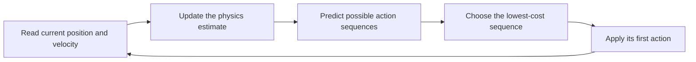

# Adaptive MPC: learning the lander's physics during flight

This standalone experiment controls the discrete-action LunarLander simulator. It uses a small physics model, a search over future engine commands,
and a running estimate of engine effectiveness. There is no policy checkpoint
to train or download. The controller itself uses NumPy and runs on the CPU.

The implementation is in [`mpc.py`](../src/lunar_mpc/mpc.py). It does not use a policy checkpoint, critic, reward model, or cloned simulator
to choose an action. No RL trainer or checkpoint is part of this repository.

## 1. What does MPC mean?

Imagine driving toward a red light. You estimate where your car will be if you
coast, brake gently, or brake hard. You choose a useful plan, act briefly, look
again, and revise the plan. You do not commit to the original plan regardless
of what happens next.

**Model Predictive Control (MPC)** follows that pattern:

1. **Model:** use equations to approximate how actions change the vehicle.
2. **Predict:** simulate several possible futures using those equations.
3. **Control:** choose the plan with the lowest cost and apply its first action.
4. Repeat after receiving the next observation.

The duration of the predicted future is the **prediction horizon**. Moving the
horizon forward after each measurement is called **receding-horizon control**.
The [OSQP MPC example](https://osqp.org/docs/examples/mpc.html) illustrates this
loop with a quadratic optimization problem.

For the lander, a plan might mean “fire the main engine, coast, correct the
angle, then brake.” Only the very next engine command is sent to the simulator.
The rest of the plan will be reconsidered 0.02 seconds later.



## 2. What makes it adaptive?

Ordinary fixed-model MPC keeps the same equations and parameter values while
replanning from each new state. **Adaptive MPC also updates its prediction
model from observations.** This implementation learns a few physical
coefficients while it is controlling the lander.

Suppose the engine produces less acceleration after a fault. The controller
predicts a certain velocity change, fires an engine, and measures a smaller
change. Its estimate of engine effectiveness starts moving downward. The next
plan then uses that lower estimate, including a more cautious descent-speed
reference because braking will take longer.

Updating a small dynamics model during operation is one established category
of learning-based MPC. The [Hewing et al. review](https://www.annualreviews.org/content/journals/10.1146/annurev-control-090419-075625)
places it alongside methods that learn controller costs or combine MPC with
learned policies.

“No offline training” still needs prior knowledge. We supply approximate
gravity, nominal engine effects, the observation scaling, the target pad, and
the available actions. Adaptation corrects some errors in those assumptions.
It cannot discover arbitrary unknown physics from a single observation.

The controller uses the current observation and its compact running parameter
estimate. Earlier observations influence that estimate; their entire history
is not stored by the controller. The evaluator records full histories for us
to inspect afterward.

## 3. What the controller can see

`AdaptiveMPC.act(obs)` accepts only the eight observation numbers:
horizontal position, height, horizontal velocity, vertical velocity, angle,
angular velocity, and two leg-contact indicators.

The first six entries use different scales. `state_from_obs` converts them:

| Observation | Multiply by | Meaning after conversion |
|---|---:|---|
| horizontal position | 10 | world units relative to pad center |
| height | 20/3 | world units relative to the nominal resting body center |
| horizontal velocity | 5 | world units/second |
| vertical velocity | 7.5 | world units/second |
| angle | 1 | radians |
| angular velocity | 2.5 | radians/second |

These constants match the pinned environment's default geometry and 50 Hz
physics. Height zero is a body-center target, not a laser measurement of the
distance from a leg tip to the terrain. The
[Gymnasium documentation](https://gymnasium.farama.org/environments/box2d/lunar_lander/)
describes the action set, observation units, and simulator caveats.

The controller does **not** receive terrain polygons, engine-fault timing,
the true engine multiplier, simulator bodies, future random numbers, or the
episode reward. It assumes a known central pad. The evaluator can inspect
simulator truth to score outcomes and draw the replay. That separation matters:
terrain-aware navigation would need an explicit terrain sensor or map input.

## 4. The prediction model

`Dynamics.predict` maintains the flight state
`[x, y, vx, vy, angle, angular_velocity]`. It approximates acceleration as:

```text
ax = -main_gain * main * sin(angle) + side_gain * side * cos(angle) + bias_x
ay =  main_gain * main * cos(angle) + side_gain * side * sin(angle) - 10 + bias_y
angular_acceleration = -turn_gain * side + turn_bias
```

Here `main` is 1 for the main-engine action and 0 otherwise. `side` is -1 for
the left-engine action, +1 for the right, and 0 otherwise. These signs match
the environment: the left engine pushes left and produces positive rotation.
The model advances velocity and then position using a semi-implicit Euler step.

Initial gains are 18 for main acceleration, 2.5 for lateral acceleration, and
5 for angular acceleration. Biases start at zero. These are nominal world-unit
accelerations, not engine power settings or estimates of physical mass alone.
The model includes translation/attitude coupling but approximates articulated
legs, stochastic engine dispersion, and orientation-dependent side torque.

`Dynamics.observe(before, action, after)` calculates acceleration from the
observed velocity difference divided by 0.02 seconds. It updates a four-parameter
translation model and a two-parameter angular model using **recursive least
squares (RLS)**. RLS is an incremental way to fit coefficients to measurements:
it keeps the current estimate and a small matrix, rather than refitting a large
stored dataset each time. A forgetting factor gives recent measurements more
influence. See the [online estimation equations](https://www.mathworks.com/help/ident/ug/algorithms-for-online-estimation.html).

For one measurement, the implementation uses:

```text
gain       = P @ features / (forgetting + features.T @ P @ features)
parameters = parameters + gain * (measured - predicted)
P          = (P - outer(gain, features.T @ P)) / forgetting
```

The forgetting factor is 0.99 per scalar update. Translation receives two
updates per environment step; rotation receives one. This difference is worth
remembering when changing the adaptation rate.

Parameter bounds keep estimates in a deliberately limited operating range:
main gain [5, 35], side gain [0.3, 6], translational biases [-4, 4], turn gain
[1, 10], and turn bias [-2, 2]. They are engineering assumptions, not measured
confidence intervals. Contact transitions and exceptionally large acceleration
changes are excluded from identification because collision impulses should
not be interpreted as changed engine strength.

With `--fixed-model`, measurements and prediction errors are still recorded,
but parameter updates are disabled. This isolates the contribution of adaptation.
Both controllers continue to observe and replan after every action.

## 5. How it searches for actions

This is **finite-control-set MPC**: the allowed action set is exactly the
environment's four actions. It uses a deterministic beam search implemented in
NumPy, so there is no new optimization dependency.

At each prediction stage, every retained candidate is extended with all four
actions. The model advances those candidates, costs are added, and only the
best `beam` candidates are retained. With 16 stages and a beam width of 32,
the search evaluates at most roughly `16 × 32 × 4` candidate transitions.
The complete tree would contain `4^16` sequences. Pruning makes computation
small, but can discard the globally best sequence.

Defaults are:

| Setting | Default | Effect |
|---|---:|---|
| `--horizon` | 16 | number of predicted action blocks |
| `--hold` | 4 | each predicted action lasts four simulated physics steps |
| `--beam` | 32 | retained candidate sequences at each search stage |

The default prediction horizon is therefore `16 × 4 / 50 = 1.28 seconds`.
Prediction uses a coarse 0.08-second integration step per block. The actual
controller still acts and replans every 0.02 seconds. Increasing `hold` makes
the model coarser; increasing `horizon` adds computation. Neither automatically
makes the lander safer.

MPC names the repeated planning procedure; QP and MIQP name optimization
formulations that could be used inside it. This implementation is an approximate
discrete search, not a QP or MIQP solver. It keeps the actuator rules directly
comparable with the existing discrete-action RL agent. A separate MIQP
experiment can later replace the search while holding observations and tests fixed.

## 6. What makes one plan better than another?

`AdaptiveMPC.cost` adds squared penalties for horizontal error, velocity error,
attitude error, and angular motion. Reference velocities and angles are computed
from each predicted state: steer toward the pad, reduce lateral speed on
approach, and descend at a manageable rate.

The vertical reference also uses the estimated main gain. A simplified braking
relation, `speed² ≈ 2 × acceleration × distance`, caps the requested descent
speed. A 0.7 gain multiplier provides extra design margin. It does not establish
a worst-case uncertainty bound. This is a specific way in which updated model
parameters influence the chosen trajectory.

Additional soft penalties discourage descending too low while far from the
pad, excessive tilt, and penetrating the target ground plane. Main-engine
firings add a small cost. These weights are hand-selected design choices and
were adjusted using development seeds 0–7.

An airborne model alone keeps predicting that gravity pulls the craft through
the ground. It can therefore prefer hovering forever. `advance` introduces a
simple terminal landing approximation: near the pad center, crossing target
height with small speed, tilt, and angular rate enters a settled state with
zero subsequent state cost. It approximates successful contact; it does not
simulate the legs or prove that contact will settle. Once a real leg-contact
indicator is observed, the controller commands idle and lets Box2D settle.

The penalties are soft, the landing model is approximate, and beam search is
incomplete. There is no formal collision-avoidance guarantee, certified terminal
safe set, or real-time scheduler. An initially unrecoverable state, severe
engine failure, unseen terrain, or a missed computation deadline can still fail.

## 7. Run it and inspect a decision

From the repository root:

```bash
uv sync --locked
uv run python -m unittest discover -s tests -v
uv run lunar-mpc --episodes 8 --seed 0 \
  --out dist/mpc/nominal.json --replay dist/mpc/nominal.html
```

The equivalent module command is `uv run python -m lunar_mpc.mpc`.

Open the generated HTML file yourself; the command does not open a browser.
It is self-contained and needs no server. Scrub the timeline to see the actual
path, the predicted future at that decision, the chosen action, engine
estimates, and planning latency. The slider includes the final post-action
state. The engine-fault marker is explanatory evaluator metadata; MPC never
receives it.

JSON records include observations, actions, rewards, next observations, plans,
predicted states, model estimates before and after the transition, and timing.
The summary includes landing counts, return, foot margins and latency
percentiles. `prediction_error` is the norm of the next-step velocity/rate
residual; it mixes linear and angular units and is a diagnostic, not a calibrated
uncertainty or a probability of failure.

## 8. Test adaptation with an unannounced engine fault

```bash
uv run lunar-mpc --episodes 8 --seed 0 --thrust-scale 0.7 --change-step 100 \
  --out dist/mpc/fault-adaptive.json --replay dist/mpc/fault-adaptive.html
uv run lunar-mpc --episodes 8 --seed 0 --thrust-scale 0.7 --change-step 100 \
  --fixed-model --out dist/mpc/fault-fixed.json
```

Immediately before action 100, the evaluator reduces the simulator's main
engine power to 70% of nominal. The side engines remain unchanged. The
controller gets its usual observations and has to infer the changed response.
The evaluator temporarily changes a process-local Gymnasium constant during
`env.step` and restores it in `finally`. This harness runs one environment per
process; do not use it concurrently with other environments in the same process.

Success requires actual episode termination without a crash or time limit,
a sleeping lander with both legs in contact, and both rendered foot endpoints
between the helipad flags. Body-center position and total reward alone are
insufficient. First-contact velocity and tilt are also recorded, without
inventing an unvalidated impact-speed threshold.

Development seeds 0–7 were used to refine approach behavior. Run seeds 200–249
once the design is frozen, using `--seed 200 --episodes 50`, and reserve a fresh
seed/scenario set if these results subsequently guide tuning. Compare fixed and
adaptive versions under identical disturbances; adaptation can trade speed or
reward for reliability, and need not outperform a good fixed model everywhere.

## 9. Historical research results

These measurements were made before standalone extraction on 2026-09-08,
using CPU NumPy planning on Apple silicon under concurrent system load. They
are historical results, not new measurements of the standalone package. See
[evaluation and reproduction](evaluation.md) for standalone validation. The design was adjusted on seeds
0–7, then evaluated without further controller tuning on seeds 200–249.
Each episode starts with a new nominal model; estimates are not carried between
episodes. The fault is a 30% main-engine power reduction at action 100.

“Pass” below means the explicit terminal and foot-position checks above, not a
reward threshold. In particular, a settled one-leg contact fails this protocol
even if Gymnasium awards its final +100 reward.

| Seeds | Scenario | Controller | Passes | Mean return |
|---|---|---|---:|---:|
| 0–7, development | nominal | adaptive MPC | 8/8 | +283.3 |
| 0–7, development | engine fault | adaptive MPC | 8/8 | +223.2 |
| 0–7, development | engine fault | fixed-model MPC | 6/8 | +275.4 |
| 200–249, evaluation | nominal | adaptive MPC | 49/50 | +287.2 |
| 200–249, evaluation | nominal | fixed-model MPC | 49/50 | +287.7 |
| 200–249, evaluation | engine fault | adaptive MPC | 49/50 | +237.9 |
| 200–249, evaluation | engine fault | fixed-model MPC | 42/50 | +275.6 |

Adaptation improved the strict landing count in this fault experiment while
taking longer and earning lower mean reward. It did not improve the nominal
pass count. These finite tests support further investigation; they do not
establish universal superiority or a certified failure probability.

All four evaluation configurations failed seed 235 by leaving the viewport,
before the scheduled fault. This identifies a common horizontal-recovery
limitation. The remaining fixed-model fault failures include one-leg settled
states and an off-pad landing; treating every failed check as a crash would be
incorrect. No controller parameters were changed after inspecting these results.

Planning latency on the evaluation runs was approximately 1.35 ms median,
1.46 ms at the 95th percentile, and 1.56 ms at the 99th percentile. Individual
calls took as long as 73.8 ms; each run contained several calls above the
20 ms physics interval. These timings include plan-trace construction but
exclude model estimation and environment stepping. Gymnasium waits for the
action before advancing physics, so this experiment does not test the physical
effect of delayed commands. A deployed controller needs a deadline-aware
execution/fallback design and full-cycle timing measurements.

The original raw traces are not bundled here. Use the reproduction commands
in [evaluation.md](evaluation.md) to generate fresh evidence under `dist/`.
There is no published retrained PPO comparison in this repository.

## 10. What to investigate next

1. Separate estimation quality from control quality: compare prediction error,
   parameter response after a fault, and final landing outcomes.
2. Investigate the seed-235 horizontal recovery failure, add explicit viewport
   handling, and use fresh evaluation seeds after making any such changes.
3. Sweep horizon and beam width under a measured computation budget. Report
   deadline misses as failures rather than relying only on average latency.
4. Add sensor noise/delay and an explicit state estimator. Current vector
   observations already provide velocities; this is not vision-only control.
5. Replace heuristic margins with justified uncertainty bounds and a validated
   recovery controller/terminal set. Test states where landing is impossible.
6. Compare this discrete search with MIQP on the same action space and a declared
   piecewise-affine model. Keep solver/model approximation errors visible.

The strongest initial question is: **can a small online physics update improve
landing reliability when engine effectiveness changes during the same flight?**
This implementation makes that question runnable and records the evidence needed
to examine both successes and failures.
